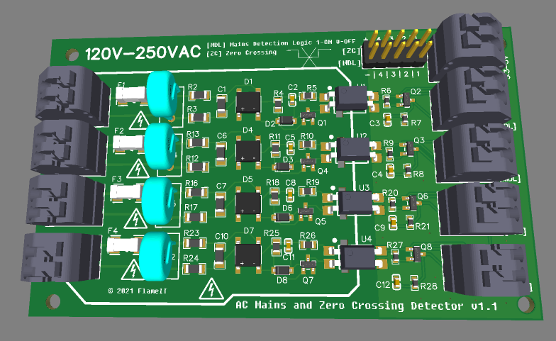
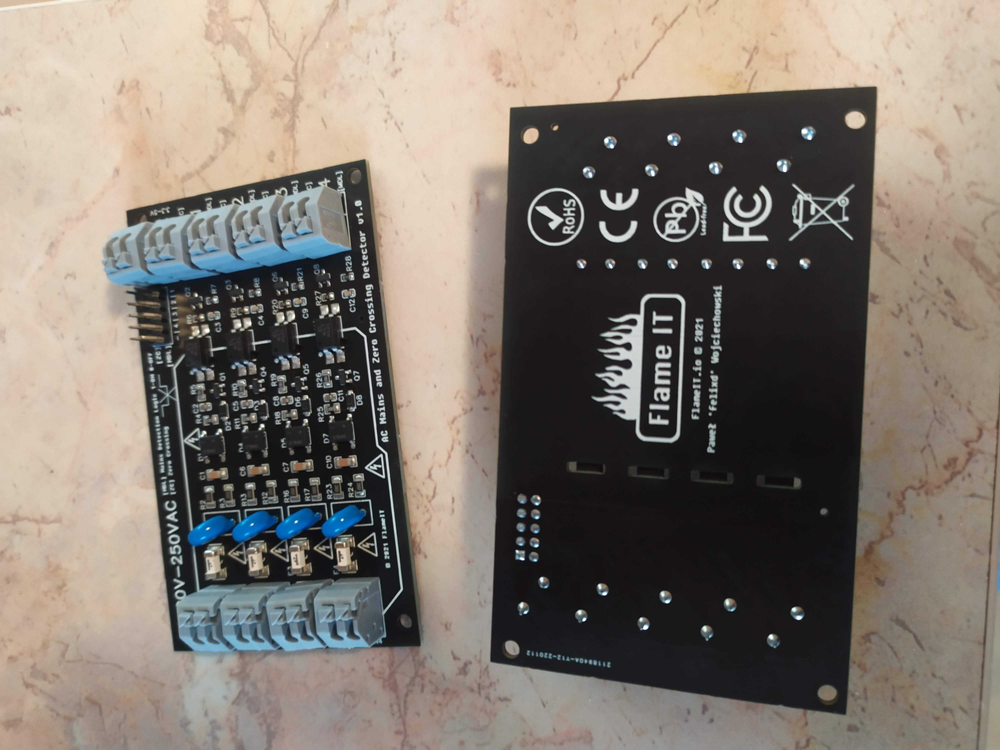
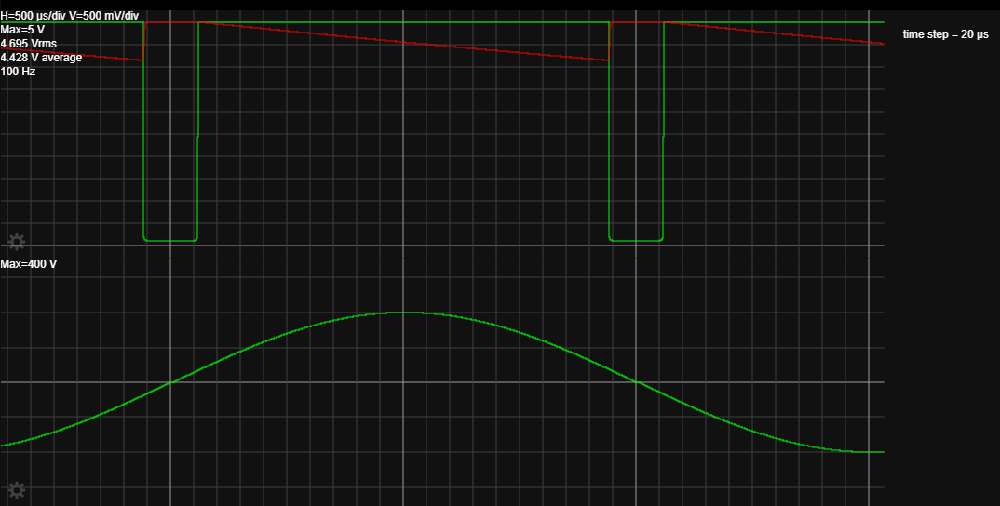

# FlameIT - AC Mains and Zero Crossing Precision Detector




## **Caution!**

```bash
!!! Caution !!!

 This module was design to connect directly to the AC grid power. 
 Its misuse might cause ELECTRIC SHOCK or FIRE.

 !!! Caution !!!
```

## Features

- very accurate mains zero crossing detection
- fully isolated (5kV optoisolation)
- low voltage, safe output (low side can be supplied with voltages from 1V up to 16V)
- ultra-low power consumption; worst case power dissipation < 120mW
- produces symmetrical pulses around the zero crossing
- very low parts count, no precision components required
- all components can be low voltage SMD
- works over all mains voltage ranges (100VAC...240VAC), without any modification
- both 50Hz (1,2ms ZC pulse) and 60Hz (1ms ZC pulse) mains frequency compatible
- highly stable with varying temperature
- ROHS compliant (Pb-free)
- extra AC input protection (fuse and varistor)
- 4 independent AC inputs on one module
- 2 low side outputs for each AC input
  - **ZCD - Zero Crossing Detection** pulse (HIGH level pulled to GND)
  - **MDL - Mains Detection Logic** (HIGH when mains is detected)
- spring clamp system terminal blocks on input and output
- extra goldpin outputs on low side

## Use cases

- Mains detection (logical output HIGH when phase is available)
- **ZCD** - Zero Crossing Detection
- Mains frequency monitoring
- Checking of connection order of three phase systems
- Checking shift between phases
- Detection of power failures
- AC motor monitoring
- other...

## Simulation



## Real module testing

### Phase Order Detection

```
Phase Order Detection
```


### Turn ON / OFF


### Mains Detection Logic


### Zero Crossing


### Zero Crossing with Mains Detection Logic


## Different designs

- https://www.electroschematics.com/detector-module/

- https://create.arduino.cc/projecthub/andrzejco/sensor-230v-ac-for-arduino-1b1109

- https://www.electronicsweekly.com/blogs/engineer-in-wonderland/improved-isolated-wide-range-zero-crossing-detector-needs-no-power-switch-2020-07/

- https://www.eevblog.com/forum/projects/mains-zero-crossing-detection/

- https://sound-au.com/appnotes/an005.htm

## Idea

This project was created using Dextrel idea: https://dextrel.net/dextrel-start-page/design-ideas-2/mains-zero-crossing-detector

## Author

* Paweł 'felixd' Wojciechowski - [FlameIT - Immersion Cooling](https://flameit.io) 
