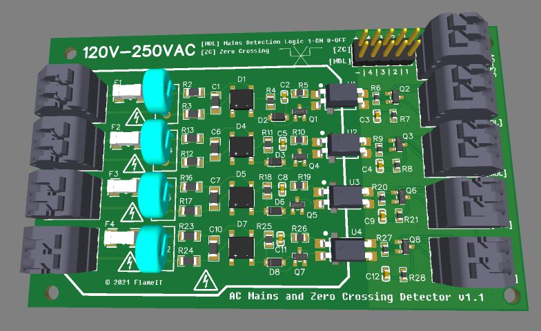
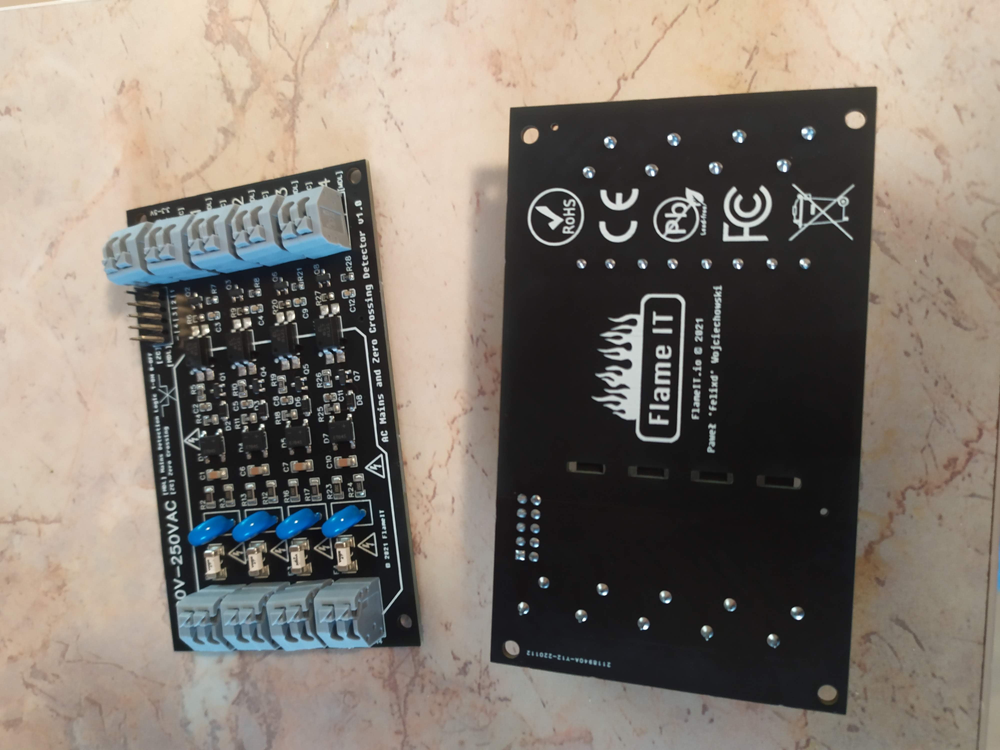
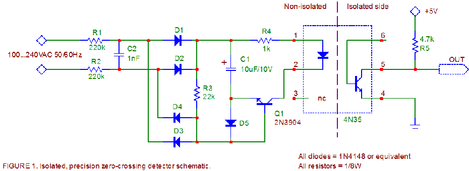
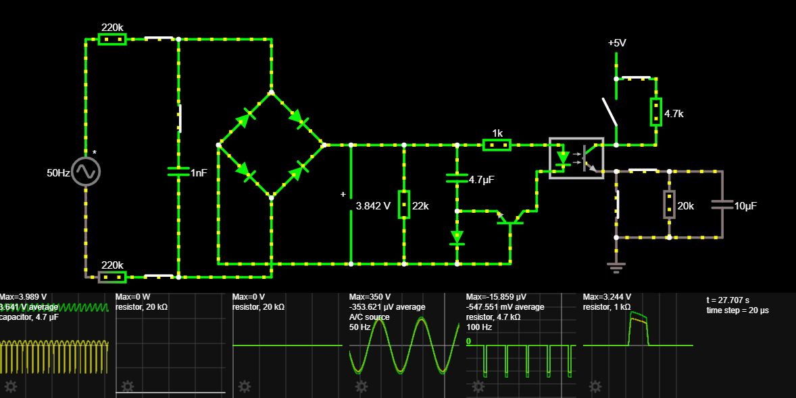
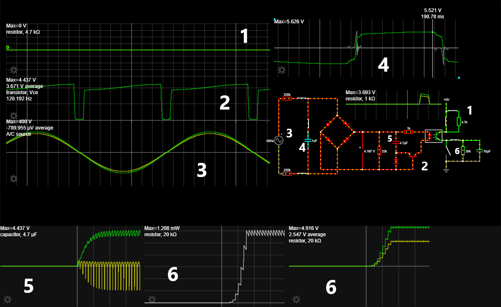
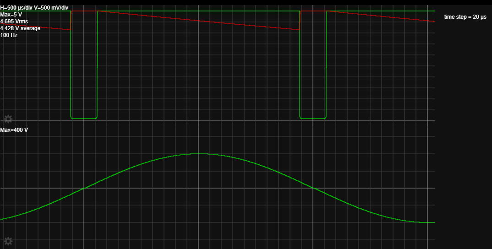

# AC Mains and Zero Crossing Precision Detector

## **Caution!**

**CAUTION:** this module was design to connect directly to the AC grid power. Its misuse might cause **ELECTRIC SHOCK or FIRE**.

## Features

- very accurate mains zero crossing detection
- fully isolated (5kV optoisolation)
- low voltage, safe output (low side can be supplied with voltages from 1V up to 16V)
- ultra-low power consumption; worst case power dissipation < 120mW
- produces symmetrical pulses around the zero crossing
- very low parts count, no precision components required
- all components can be low voltage SMD
- works over all mains voltage ranges (100VAC...240VAC), without any modification
- both 50Hz (1,2ms ZC pulse) and 60Hz (1ms ZC pulse) mains frequency compatible
- highly stable with varying temperature
- ROHS compliant (Pb-free)
- AC input protection
- 4 independent AC inputs
- 2 low side outputs for each input
  * **ZCD - Zero Crossing Detection** pulse (HIGH level pulled to GND)
  * **MDL - Mains Detection Logic** (HIGH when mains is detected)

## Use cases

* Mains detection (Module has two outputs for every AC input)
* ZCD - Zero Crossing Detection
* Mains Frequency counting
* Three Phase sequence checking (order of phase lines connections)
* Checking interphase shift
* Detection of power failures
* ...and others (check original Dextrel page for more applications): https://web.archive.org/web/20180209005931/http://www.dextrel.net:80/diyzerocrosser.htm 

## Original design

Original concept was created by Dextrel. Our module has extra imput protection and MDL (Mains Detection Logic)

https://web.archive.org/web/20180209005931/http://www.dextrel.net:80/diyzerocrosser.htm

## Simulation

* [Circuit Simulation](https://tinyurl.com/yasss96p)

Data for above simulator are also in: [./simulation/simulation.circuit](./simulation/simulation.circuit) file

## Module testing

### Phase Order Detection

### Turn ON / OFF

### Mains Detection Logic

### Zero Crossing

### Zero Crossing with Mains Detection Logic

## Different designs

* https://www.electroschematics.com/detector-module/

* https://create.arduino.cc/projecthub/andrzejco/sensor-230v-ac-for-arduino-1b1109

* https://www.electronicsweekly.com/blogs/engineer-in-wonderland/improved-isolated-wide-range-zero-crossing-detector-needs-no-power-switch-2020-07/

* https://www.eevblog.com/forum/projects/mains-zero-crossing-detection/

## Author

* Paweł 'felixd' Wojciechowski
